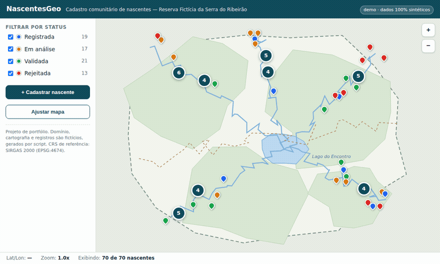

# NascentesGeo — cadastro comunitário offline-first (demo de portfólio)

**Demo viva:** https://wfoliveira-rj.github.io/nascentes-geo/web/
*(instalável como PWA — no celular: abrir o link e "Adicionar à tela inicial")*

Plataforma fictícia de cadastro comunitário de nascentes d'água com workflow de validação
(REGISTRADA → EM_ANALISE → VALIDADA/REJEITADA), construída para provar engenharia
**offline-first de campo**: o app abre, navega e cadastra **com a rede desligada**.

## O que este repositório demonstra

**Motor de mapa vetorial autocontido** (SVG/JS puro, zero dependências): pan, zoom ancorado
no cursor, pinch com dois dedos, clusters em grade, popups e filtros por status.
**PWA instalável** com app shell em service worker. **Download de região para uso offline**
com estimativa de tamanho, barra de progresso, verificação de integridade **SHA-256 por
chunk** e armazenamento em IndexedDB. **Prova automatizada**: teste E2E (Playwright) que
desliga a rede, recarrega e exige o mapa funcionando (`tools/verify_offline.js`).

## Rodando localmente

Duplo clique em **`testar.cmd`** (requer Node) — sobe `http://localhost:8123` e abre o
navegador. Abrir o `index.html` direto também mostra o mapa (dados embutidos), mas os
recursos de PWA/offline exigem http/HTTPS.

## Dados

Domínio, cartografia e registros são **100% fictícios**, gerados por script
(`tools/gen_data.py`, seed fixo). CRS de referência: SIRGAS 2000 (EPSG:4674).

## Decisões de arquitetura

A separação app shell (service worker) × dados (chunks verificados em IndexedDB), e a
regra "offline se prova com a rede desligada", estão documentadas em ADRs no repositório
[geo-field-kit](https://github.com/WFOliveira-RJ/geo-field-kit) — o projeto irmão que
evolui este motor para dados públicos reais (IBGE/CNEFE).

## Série de portfólio

[licensehub-api](https://github.com/WFOliveira-RJ/licensehub-api) ·
[architecture-decisions](https://github.com/WFOliveira-RJ/architecture-decisions) ·
**nascentes-geo** ·
[geo-field-kit](https://github.com/WFOliveira-RJ/geo-field-kit)

---

*Offline-first community springs registry (portfolio demo). Self-contained SVG/JS map
engine, installable PWA, region download with per-chunk SHA-256 integrity into IndexedDB,
and an automated E2E proof that turns the network off and requires the app to keep working.
All data is synthetic, generated by script.*
